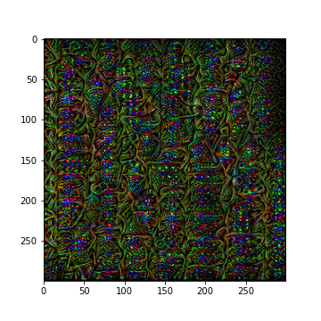

# tensorflow-feature-extraction-tutorial
A short tutorial to get started with feature extraction in CNNs, based on TensorFlow's [DeepDream code](https://www.tensorflow.org/tutorials/generative/deepdream). Content available under CC BY 4.0 and code under Apache 2.0 License.

This project was born as I couldn't find a good working tutorial for feature visualization. Things like [How to visualize convolutional features in 40 lines of code](https://towardsdatascience.com/how-to-visualize-convolutional-features-in-40-lines-of-code-70b7d87b0030) sounded great until I realized they need `fastai==0.7.0` and do `fastai.conv_learner import *`. I did this as part of the EA Cambridge's [Technical Alignment Curriculum](https://www.eacambridge.org/technical-alignment-curriculum).

Click [here](https://github.com/Stefan-Heimersheim/tensorflow-feature-extraction-tutorial/blob/main/feature_extraction_dream.ipynb) or above to see the notebook.

